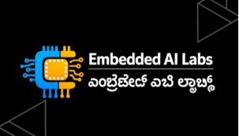

# Automotive ESP32-C3 Edge Gateway & ECU Engineering Platform



**Embedded AI Design Labs Pvt Ltd**  
ಎಂಬೆಡೆಡ್ ಎಐ ಲ್ಯಾಬ್ಸ್  
Author: Muhammad Samiullah, CTO & Founder — muhammadsami@embedailabs.com  
GitHub: [Embedded-AI-Design-Labs-Pvt-Ltd](https://github.com/Embedded-AI-Design-Labs-Pvt-Ltd/)

One reusable embedded platform. Seventeen product applications assembled from the same HAL, drivers, protocols, and services.

**Targets:** POSIX Virtual ECU (no hardware) · ESP32-C3 + ESP-IDF + FreeRTOS · later MQTT/TLS cloud sidecar

Portable C services must not call pthread, FreeRTOS, or ESP-IDF — only OSAL and HAL. Architecture: [docs/architecture/](docs/architecture/README.md).

**CAN lab (Classical CAN only):** external transceiver required · [hardware](docs/hardware/hardware_architecture.md) · [orchestrator](docs/architecture/can_lab_orchestrator.md) · [DBC](dbc/aegw_c3_proto.dbc) · [BUILD_STATUS](BUILD_STATUS.md) · [traceability](REQUIREMENTS_TRACEABILITY.md).

This repository is **not** seventeen separate products. It is one core platform plus thin product compositions.

## Run locally

```powershell
powershell -NoProfile -ExecutionPolicy Bypass -File tools\scripts\run_all.ps1
python tools\gui\server.py
```

POSIX CMake (same host tests, no ESP32 required):

```powershell
cmake -S . -B build/cmake
cmake --build build/cmake --config Debug
ctest --test-dir build/cmake -C Debug --output-on-failure
```

GUI (Virtual ECU, no hardware): http://127.0.0.1:8765/

Administrator / toolchain helper (UAC prompt):

```powershell
powershell -NoProfile -ExecutionPolicy Bypass -File tools\scripts\setup_admin.ps1
```

## Read this first

- [docs/index.html](docs/index.html) — architecture portal
- [docs/architecture/README.md](docs/architecture/README.md) — three-target architecture (POSIX · ESP32-C3 · cloud)
- [docs/pages/13-posix-cloud-platform.html](docs/pages/13-posix-cloud-platform.html) — portal summary of execution targets
- [docs/presentation.html](docs/presentation.html) — slide deck

## Layered model

```
Application (product composition)
        ↓
Automotive Services
        ↓
Protocols (CAN · ISO-TP · UDS · OBD-II)
        ↓
Middleware (IPC · logger · config · health)
        ↓
HAL
        ↓
Drivers
        ↓
ESP32-C3 hardware
```

## Repository map

| Path | Role |
|---|---|
| `platform/` | Reusable modules only |
| `products/` | Thin product applications (P01–P17) |
| `ports/` | ESP32-C3, Arduino, Raspberry Pi 5, Virtual ECU |
| `tools/` | PC GUI, Virtual ECU, scripts |
| `tests/` | Unit, integration, HIL, regression |
| `infra/` | Docker, Jenkins, Terraform (AWS/GCP/Azure) |
| `docs/` | Architecture HTML portal and presentation |

---

**Embedded AI Design Labs Pvt Ltd**  
Muhammad Samiullah  
CTO & Founder  
© 2026 Copyright. All rights reserved.

