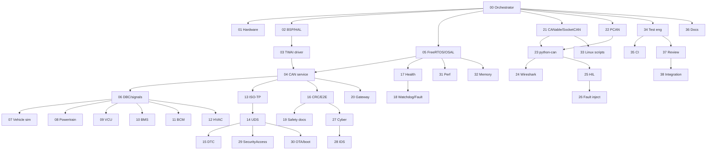

# AGENT 00 — Project Orchestrator Baseline

**Date:** 2026-08-27  
**Repository:** `ESP32_C3_Automotive_Products`  
**Brand:** Embedded AI Design Labs Pvt Ltd  
**Scope:** Automotive CAN ECU lab (ESP32-C3 Classical CAN/TWAI + Linux SocketCAN)

## Governing decisions (frozen)

1. **Do not rewrite** the working host C stack in one pass. Live code stays in `platform/`, `products/`, `ports/`.
2. New trees (`firmware/`, `linux/`, …) are **canonical lab layout** with READMEs that map to existing modules until code is moved carefully.
3. ESP32-C3 = **Classical CAN only** (TWAI). **No CAN-FD** features on this MCU.
4. Application / protocols / services must not include ESP-IDF, FreeRTOS, or pthread headers — only OSAL + HAL.
5. External CAN transceiver is **required** (e.g. SN65HVD230 / TJA1051). TWAI alone is not a physical bus.
6. Lab / virtual ECU / HIL only. **Never** connect experimental tools to a real road vehicle.
7. Prototype ≠ certified: no ISO 26262 or UNECE R155 claims.
8. No fake `return AE_OK` stubs. Empty modules get README + status = Not started.
9. Common APIs are owned by Orchestrator: `ae_can_frame_t`, `ae_status_t`, `hal_can_*`, `can_svc_*`, `isotp_*`, `uds_*`, DTC/fault enums. Agents must not redefine them.
10. One phase at a time: build → test → review → document → commit → update status files.

## Physical architecture

```text
ESP32-C3 ── TWAI TX/RX ── CAN transceiver (SN65HVD230/TJA1051)
                              │
                           CANH / CANL (+ 120 Ω termination as required)
                              │
                     CANable / PCAN-USB / USB-CAN
                              │
                     Linux SocketCAN (can0)
                              │
              python-can · can-utils · Wireshark · HIL scripts
```

## Layered software (unchanged rule)

```text
Application / products
        ↓
Services (DTC, fault, health, security, OTA, ECU models)
        ↓
Protocols (CAN service, ISO-TP, UDS, OBD, E2E)
        ↓
Middleware / OSAL
        ↓
HAL
        ↓
Drivers (posix | esp32 TWAI)
        ↓
Hardware or virtual bus
```

## Live code vs lab layout

| Lab path (target) | Current home (do not duplicate) |
|---|---|
| `firmware/hal` | `platform/hal/` |
| `firmware/can` | `platform/protocols/can_service.*` + future TWAI driver |
| `firmware/diagnostics` | `platform/protocols/{isotp,uds}.*` + `platform/services/dtc.*` |
| `firmware/safety` | `platform/services/fault_mgr.*` + `docs/safety/` |
| `firmware/application` | `products/` |
| `firmware/bootloader` | conceptual / `ota_agent` only today |
| `linux/*` | **new** — SocketCAN / python-can (not started) |
| `dbc/` | **new** |
| `ci/` | **new** (GitHub Actions later) |

See [directory_mapping.md](directory_mapping.md).

## Agent dependency order (execute in waves)



## Wave plan (do not skip)

| Wave | Agents | Exit gate |
|---|---|---|
| **W0** | 00 | Status files + mapping + frozen APIs — **this commit** |
| **W1** | 01 Hardware docs | GPIO/transceiver docs reviewed |
| **W2** | 02+05 OSAL/HAL/BSP | OSAL POSIX tests green; HAL contracts stable |
| **W3** | 03+04 TWAI + CAN service | Host tests green; Arduino/IDF TWAI path documented |
| **W4** | 06–12 signals + ECU models | DBC + encode/decode tests |
| **W5** | 13–16 ISO-TP/UDS/DTC/E2E | Harden existing stacks + E2E module |
| **W6** | 17–20 health/fault/safety/gateway | Health API + fault escalation |
| **W7** | 21–24 Linux tooling | SocketCAN scripts + python-can (Linux host) |
| **W8** | 25–28 HIL/fault/IDS | Lab-only security tests |
| **W9** | 29–33 SA/OTA/perf/memory/scripts | Prototype update + benchmarks |
| **W10** | 34–38 test/CI/docs/integration | CI green on POSIX; IDF optional |

## Status dashboards

- [BUILD_STATUS.md](../../BUILD_STATUS.md)
- [REQUIREMENTS_TRACEABILITY.md](../../REQUIREMENTS_TRACEABILITY.md)
- [TEST_STATUS.md](../../TEST_STATUS.md)

## Next implementation (after W0)

**Wave 1–2 start:** Hardware architecture doc (Agent 01) + OSAL POSIX (Agent 05 / existing `osal_engineer.md`).  
Not BLE. Not MQTT. Not CAN-FD.

---

**Embedded AI Design Labs Pvt Ltd**  
Muhammad Samiullah — CTO & Founder  
© 2026 Copyright. All rights reserved.
