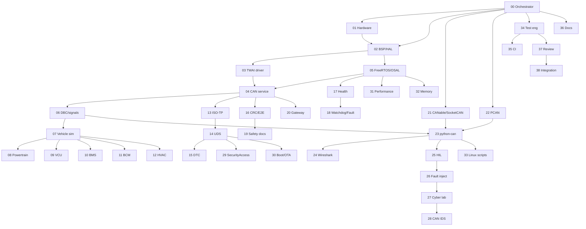

# CAN Laboratory — Agent 00 Orchestrator

**Embedded AI Design Labs Pvt Ltd** · Prototype lab (not ISO 26262 / WP.29 certified)

## Governing decisions

1. **Portable core stays in `platform/` + `products/`**. Do not fork a second UDS/ISO-TP/CAN stack under `firmware/` or `linux/`.
2. **`firmware/`** is the ESP-IDF packaging view (maps to `platform/` + `ports/esp32_c3/`). Empty of duplicate `.c` until IDF wiring is real.
3. **`linux/`** is SocketCAN / python-can / HIL host tooling. It talks to the ECU over Classical CAN only (no CAN-FD on ESP32-C3).
4. **Common types** are only those in `platform/common/ae_types.h`, `ae_can_ids.h`, `hal_can.h`. Agents must not redefine `ae_can_frame_t`.
5. CAN IDs in `ae_can_ids.h` / `dbc/aegw_c3_proto.dbc` are **prototype/simulated**.
6. Lab security and fault injection: **bench / Virtual ECU only**. Never on a road vehicle.

## Lab topology

```text
ESP32-C3 ECU  <->  SN65HVD230/TJA1051  <->  CANH/CANL  <->  CANable/PCAN-USB  <->  Linux PC (SocketCAN)
                         |
                    Virtual ECU / host HAL (no silicon)
```

ESP32-C3 TWAI = **Classical CAN only**. No CAN-FD features on the MCU path.

## Agent dependency order (do not skip)



## Phase status (this repository)

| Phase | Agents | State |
|---|---|---|
| L0 Orchestration + mapping | 00, 36 | **In progress** |
| L1 Hardware + docs | 01 | Started |
| L2 Host CRC/E2E + DBC | 06, 16 | Started |
| L3 Linux SocketCAN/python | 21–23, 33 | Started (scripts; needs Linux HW) |
| L4 OSAL POSIX | 05 | Next (see `osal/`) |
| L5 ESP-IDF TWAI | 02, 03 | Not started |
| L6 ISO-TP/UDS harden | 13–15, 29–30 | Partial (`platform/protocols`) |
| L7 ECUs + HIL + security | 07–12, 25–28 | Partial models; HIL later |
| L8 CI + integration | 34–38 | Partial host CMake |

## Interface freeze (do not redefine)

| Interface | Owner path |
|---|---|
| CAN frame | `platform/common/ae_types.h` → `ae_can_frame_t` |
| Prototype IDs | `platform/common/ae_can_ids.h` |
| HAL CAN | `platform/hal/hal_can.h` |
| CAN service | `platform/protocols/can_service.h` |
| ISO-TP | `platform/protocols/isotp.h` |
| UDS | `platform/protocols/uds.h` |
| DTC / fault | `platform/services/dtc.h`, `fault_mgr.h` |
| Product composition | `products/product_api.h` |
| E2E/CRC | `platform/protocols/crc_e2e.h` (new) |
| DBC source of truth | `dbc/aegw_c3_proto.dbc` |

## Coding standards (summary)

- C11 portable core; C++ at host edges only.
- `ae_status_t` returns; no heap on RX/TX/ISO-TP/UDS paths.
- No `pthread` / FreeRTOS / ESP-IDF in `products/` or `platform/protocols/` (OSAL/drivers only).
- Tests: ID, setup, stimulus, expected, timeout, pass/fail.
- No `return AE_OK` stub modules.

## Status files

- [BUILD_STATUS.md](../../BUILD_STATUS.md)
- [REQUIREMENTS_TRACEABILITY.md](../../REQUIREMENTS_TRACEABILITY.md)
- [TEST_STATUS.md](../../TEST_STATUS.md)
- [directory_mapping.md](directory_mapping.md)

---

**Muhammad Samiullah · CTO & Founder · © 2026**
