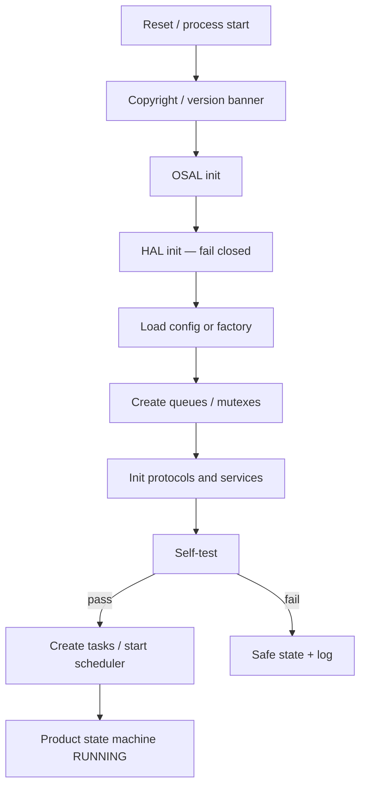

# Control flow

## 1. Boot (both targets)



Init failure: do not start CAN TX. Report through UART if possible. Kick watchdog only according to policy.

## 2. ECU state machine (Virtual ECU / product)

```text
OFF → BOOT → INIT → SELF_TEST → READY → RUNNING
                                      ↘ DEGRADED → FAULT → SAFE_STATE → SHUTDOWN
```

Existing `fault_mgr` states: `NORMAL`, `DETECTED`, `DEGRADED`, `RECOVERY`, `SAFE`. Map new names onto this enum; do not fork a second fault SM.

## 3. UDS session

Existing server: Default / Programming / Extended, prototype Security Access, S3 timeout via `uds_server_tick`.

```mermaid
stateDiagram-v2
  [*] --> Default
  Default --> Extended: 0x10
  Default --> Programming: 0x10
  Extended --> Default: S3 timeout / 0x10
  Programming --> Default: reset / timeout
  Extended --> Unlocked: 0x27 success
  Unlocked --> Extended: fail / timeout
```

Negative responses for invalid length, wrong session, security required. P2 / P2* are prototype timers; document values in config.

## 4. OTA (prototype)

Existing states: `BOOT_SELECT`, `DOWNLOAD`, `TRANSFER`, `VERIFY`, `COMMIT`, `DISCARD`.

Rule: **do not overwrite the running image** until verify (CRC/hash) succeeds. POSIX simulates slots in files or RAM. ESP32 uses OTA partitions later.

Transports conceptually: UART, CAN, BLE, cloud-triggered. Implement POSIX simulated flow before flashing.

## 5. Bus-off and comms loss

1. Detect bus-off / RX timeout via HAL + `can_svc_expect`.
2. Confirm / debounce in Fault Manager.
3. Map to DTC (`AE_DTC_COMMS` and ID-specific DTCs).
4. Recovery: HAL bus reset with backoff; if repeated, SAFE_STATE and TX silent.

## 6. Watchdog

Health bits from tasks → watchdog task reads event group → kick HAL WDT. Missing heartbeat → no kick → reset (MCU) or test abort (POSIX).

---

**Embedded AI Design Labs Pvt Ltd**  
Muhammad Samiullah  
CTO & Founder  
© 2026 Copyright. All rights reserved.
