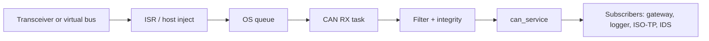
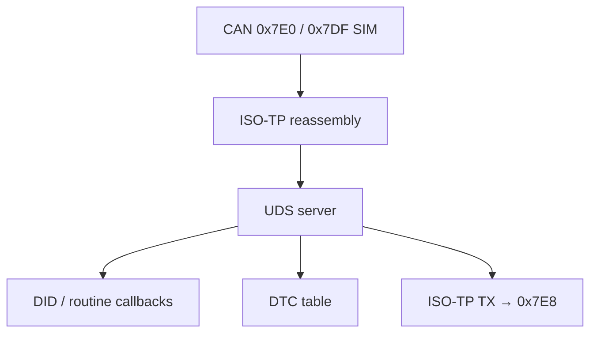
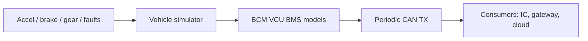
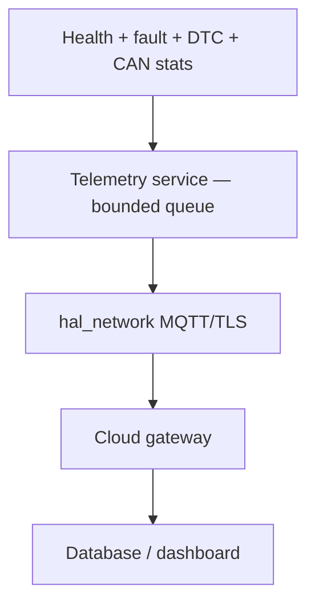

# Data flow

## 1. CAN frame path (hot path)

Copy `ae_can_frame_t` by value. No malloc. Integrity failures go to Fault Manager, not silently dropped without a counter.

## 2. Diagnostic path

BLE and UART (later) are **transports** into the same UDS/DTC tables. They must not own a second diagnostic database.

## 3. Vehicle signal path

Do not put vehicle physics inside `hal_can` or the TWAI driver.

## 4. Telemetry path (future cloud)

Payload (prototype): vehicle ID, ECU ID, timestamp, vehicle state, CAN statistics, health, fault, DTC, battery, temperature, software version, security event IDs.

If the MQTT link is down, drop newest or oldest per policy and increment a counter. Never block CAN RX on cloud.

## 5. Configuration and identity

| Data | Owner | Persistence |
|---|---|---|
| Prototype CAN IDs | `ae_can_ids.h` | Compile-time |
| VIN / SW / HW DIDs | product DID table | ROM + optional NVS |
| Bitrate, BLE name, routes | config store | NVS / file |
| Cloud URL / certs | environment | Not in source |

## 6. Logging

Logger is a **sink**. Control decisions must not wait on UART. ISR-safe ring; task drains to UART/BLE/file.

---

**Embedded AI Design Labs Pvt Ltd**  
Muhammad Samiullah  
CTO & Founder  
© 2026 Copyright. All rights reserved.
