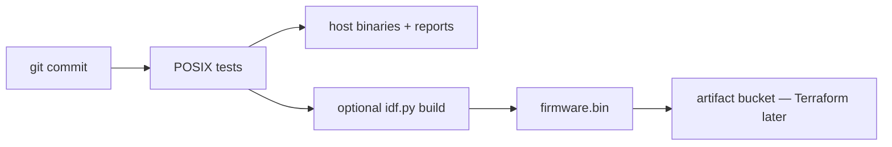

# Deployment architecture

## 1. Target matrix

| Target | Build | Run | Hardware |
|---|---|---|---|
| Host unit tests | GCC/Clang or CMake `AE_HOST=1` | `ctest` / `run_all.ps1` | None |
| Virtual ECU + GUI | Host C + Python GUI | `python tools/gui/server.py` | None |
| POSIX apps (future) | CMake | `virtual_ecu`, `vehicle_simulator`, … | None |
| Arduino ESP32-C3 | Arduino CLI FQBN `esp32:esp32:esp32c3` | Serial USB | Dev board (not Intel AMT COM) |
| ESP-IDF ESP32-C3 | `idf.py build flash monitor` | FreeRTOS | TWAI transceiver |
| Cloud gateway | Separate process | MQTT/TLS | Network; secrets outside git |

## 2. POSIX / Linux (and Windows host)

```text
Developer PC
  ├── CMake or tools/scripts/run_all.ps1
  ├── build/host/*.exe  (tests, later apps)
  └── tools/gui/server.py  → 127.0.0.1:8765
```

Windows is a first-class **host test** environment in this repo. Linux CI should run the same C sources. Do not require ESP32 to merge platform C changes.

## 3. ESP32-C3

```text
ports/esp32_c3/          (IDF project — to create)
  CMakeLists.txt
  sdkconfig.defaults
  main/app_main.c        calls portable product_api only
  EXTRA_COMPONENT_DIRS → platform, osal/freertos, drivers/esp32
```

Flash only a real ESP32-C3 USB-SERIAL port. Do not treat Intel AMT SOL as the MCU.

## 4. Cloud (lab prototype)

```text
ECU or Virtual ECU
    → MQTT/TLS
    → Cloud gateway
    → Telemetry service
    → SQLite or hosted DB
    → Dashboard
```

No production vehicle backend. No secrets in the repository. Optional local broker for lab only, documented in `cloud/README.md`.

## 5. Artifact flow (later CI)



---

**Embedded AI Design Labs Pvt Ltd**  
Muhammad Samiullah  
CTO & Founder  
© 2026 Copyright. All rights reserved.
