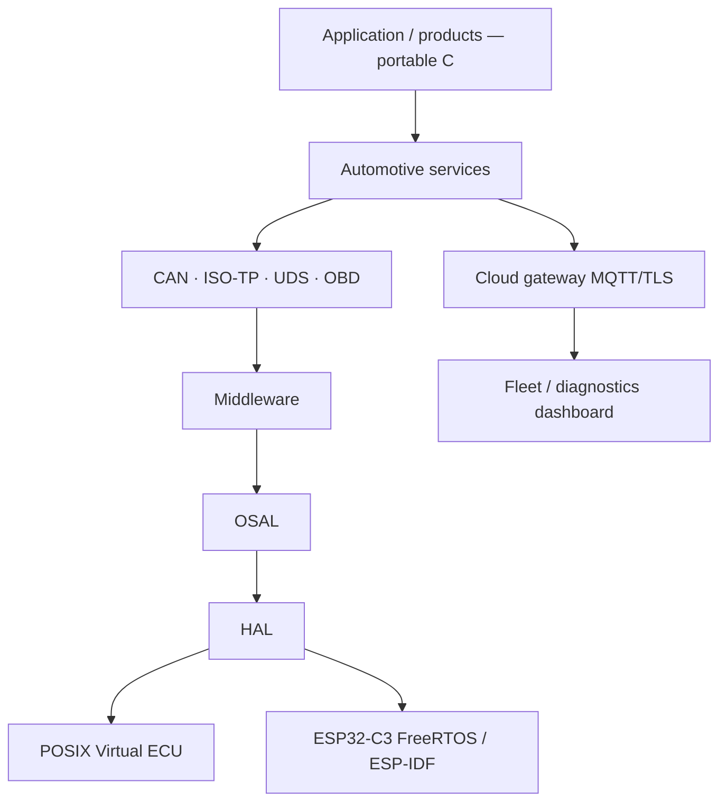

# STEP 0 — Repository analysis and gap analysis

Date: 2026-08-26  
Repository: `ESP32_C3_Automotive_Products`  
Brand: Embedded AI Design Labs

This document is the master-prompt analysis. It does **not** invent missing modules as compiling stubs.

## 1. What the repository actually is

The workspace is **not** empty. A host-compilable C platform, 17 product compositions, Virtual ECU GUI, Arduino sketch generation, and HTML architecture portal already exist.

Runnable today (no ESP32 silicon required):

```powershell
powershell -NoProfile -ExecutionPolicy Bypass -File tools\scripts\run_all.ps1
python tools\gui\server.py
```

GUI: http://127.0.0.1:8765/

Host tests compile with GCC (`-DAE_HOST=1`) via `tools/scripts/run_all.ps1`. There is **no** root CMake yet and **no** ESP-IDF component project that links TWAI/NimBLE.

## 2. Existing modules (real code)

| Layer | Path | Reality |
|---|---|---|
| Types / errors | `platform/common/` | Real (`ae_types.h`, `ae_error`, prototype CAN IDs, VIN DID `0xF190`) |
| Ring buffer | `platform/framework/` | Real |
| HAL (host) | `platform/hal/hal_host.c` | Real in-memory CAN bus + GPIO/ADC/I2C/SPI/NVS/WDT shims |
| HAL (Arduino) | `ports/arduino/` + generated sketch | Real sketch build path; not ESP-IDF |
| CAN service | `platform/protocols/can_service.*` | Real subscribe / expect / timeout stats |
| ISO-TP | `platform/protocols/isotp.*` | Real SF/FF/CF/FC prototype, 128-byte cap |
| UDS | `platform/protocols/uds.*` | Real client/server for listed SIDs |
| DTC / fault / ECU models / OTA SM / BLE shim | `platform/services/` | Real host logic; BLE is a notify/inject shim, not NimBLE |
| Products P01–P17 | `products/` | Real composition `init`/`run` on the host bus |
| Virtual ECU C++ | `ports/virtual_ecu/` | Real host port |
| PC GUI | `tools/gui/` | Real local dashboard over the host simulator |
| Docs portal | `docs/` | Real HTML; some pages still say “Phase 2 only / no firmware” |

## 3. Empty or README-only (not implemented)

| Path | Intended role |
|---|---|
| `platform/bsp/` | Board pin map, clocks, transceiver enable |
| `platform/drivers/` | ESP32-C3 TWAI, UART, GPIO, I2C, SPI, ADC, PWM, NVS, WDT |
| `platform/middleware/` | OSAL wrappers, logger, config, health, typed IPC |
| `infra/docker`, `infra/jenkins`, `infra/terraform` | CI images and artifact stores |
| OSAL POSIX / FreeRTOS backends | **Missing entirely** |
| ESP-IDF `CMakeLists.txt` / `sdkconfig.defaults` | **Missing** |
| MQTT/TLS cloud backend and fleet dashboard | **Missing** |
| GitHub Actions | **Missing** |
| Vehicle physics model with 0.1x / 1x / 10x | **Missing** (ECU signal fillers exist) |
| CAN integrity layer (CRC, alive counter, plausibility) | **Missing** as a reusable module |
| Health manager (CPU/stack/heartbeat) | **Missing** |

## 4. Gap vs master prompt

| Requirement | Status | Next honest step |
|---|---|---|
| POSIX / Linux Virtual ECU | Partial | Host tick + in-memory CAN. Need OSAL threads, virtual HW fault injection, CMake |
| Native C/C++ simulator | Partial | `hal_host` + products + GUI. Need vehicle model app |
| ESP32-C3 + ESP-IDF + FreeRTOS | Not started as IDF | Arduino sketch exists; IDF HAL/drivers and `app_main` task set do not |
| Hardware-connected ECU | Not verified | No confirmed ESP32 USB CAN transceiver bring-up in this workspace |
| Cloud-connected vehicle | Not started | Architecture only; no MQTT, no credentials store, no fleet DB |
| OSAL (`os_thread` … `os_atomic`) | Missing | **First implementation slice after this package** |
| Application free of POSIX/IDF | Partial | Services are portable C, but there is no OSAL; host uses cooperative `*_tick()` |
| HAL split POSIX vs ESP32 backends | Partial | One host file; no `drivers/esp32` |
| Modular CMake POSIX + IDF | Missing | Scripted GCC today |
| CI on every commit | Missing | Local `run_all.ps1` only |
| Unit tests per module | Partial | Strong host coverage of existing C; no OSAL/IDF tests |
| No fake compile stubs | Policy | Keep: empty dirs get READMEs, not dummy `.c` that return `AE_OK` |

## 5. Three execution targets (target picture)



The same service layer must compile for POSIX and FreeRTOS. Cloud is a **sidecar**: the ECU publishes telemetry through `hal_network` / a telemetry service; it must not embed broker credentials in source.

## 6. What we will not do in this analysis step

- Rename the live tree to `automotive_virtual_ecu/` in one commit (breaks Arduino copy and tests).
- Invent ESP-IDF drivers that compile but do not talk to TWAI.
- Claim functional-safety or cybersecurity certification.
- Start with BLE or cloud before OSAL + POSIX HAL + CAN integrity.

## 7. Immediate development order

```text
REQUIREMENTS / ARCHITECTURE  (this folder)
        │
        ▼
   C/C++ CORE           (exists — harden, do not rewrite)
        │
        ▼
      OSAL
   ┌────┴────┐
   ▼         ▼
 POSIX    FreeRTOS headers + IDF wiring
   │         │
   └────┬────┘
        ▼
       HAL backends (POSIX sim, ESP32-C3)
        │
        ▼
 CAN integrity → ISO-TP/UDS harden → diagnostics
        │
        ├──────────┐
        ▼          ▼
  Health        Fault
        └────┬─────┘
             ▼
      Safety / Security prototype
             │
        ┌────┴────┐
        ▼         ▼
       BLE       Cloud
        └────┬────┘
             ▼
         PRODUCTS
```

---

**Embedded AI Design Labs Pvt Ltd**  
Muhammad Samiullah  
CTO & Founder  
© 2026 Copyright. All rights reserved.
