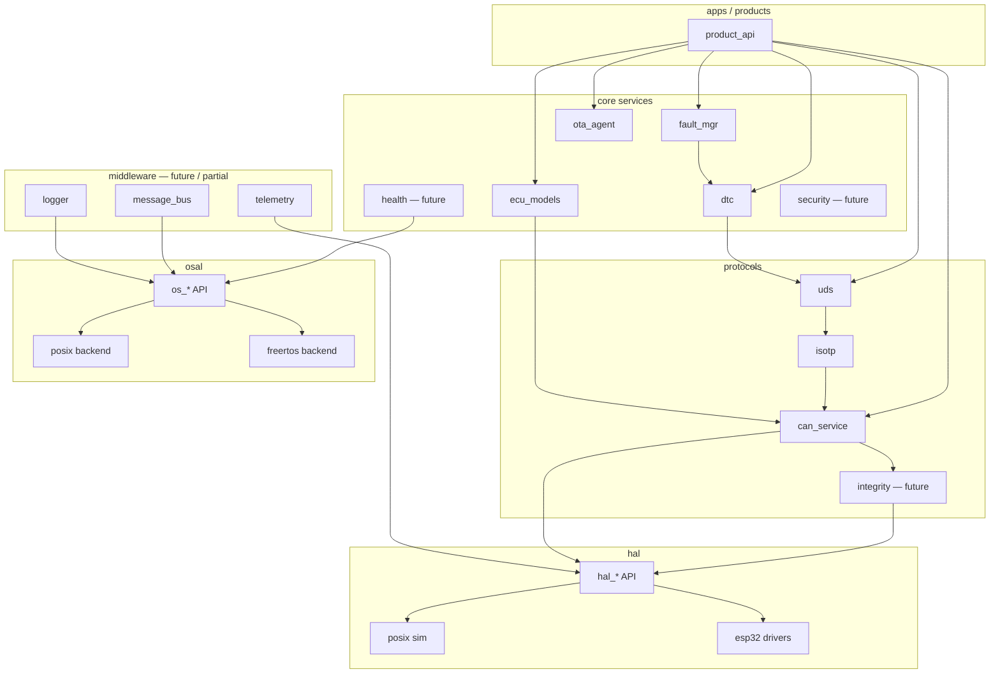

# Module dependency graph

## 1. Allowed graph

Backends (`posix`, `freertos`, `esp32` drivers) are leaves. Nothing above OSAL/HAL may depend on a specific backend.

## 2. Current vs target include roots

| Today | Target |
|---|---|
| `platform/common` | stays |
| `platform/framework` | stays (ring, later SM helpers) |
| `platform/hal` | split API vs `drivers/posix` / `drivers/esp32` |
| `platform/protocols` | stays; add `crc` / integrity |
| `platform/services` | stays; add health, security |
| `platform/middleware` empty | OSAL lives in `osal/` or `platform/osal/` |
| `products/` | stays; optional `apps/` wrappers for CLI binaries |
| `ports/esp32_c3` | IDF project that **links** platform + osal/freertos + drivers/esp32 |
| `ports/virtual_ecu` | POSIX app that **links** platform + osal/posix + drivers/posix |

## 3. Forbidden edges

- `products/*` → `freertos/FreeRTOS.h`
- `products/*` → `esp_wifi.h` / `driver/twai.h`
- `uds.c` → `pthread.h`
- `can_service.c` → vehicle physics
- `hal_host.c` → UDS

## 4. Test dependency

Unit tests may include the module under test plus fakes for OSAL/HAL. They must not require an ESP32 board.

Integration tests on POSIX may start multiple `os_thread`s. HIL tests may use real TWAI.

---

**Embedded AI Design Labs Pvt Ltd**  
Muhammad Samiullah  
CTO & Founder  
© 2026 Copyright. All rights reserved.
