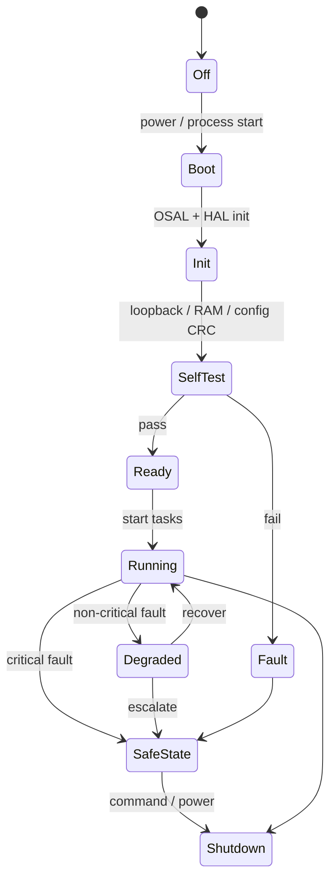

# Runtime architecture

Today the host platform is **cooperative**: products call `init`/`run` and protocol `*_tick(now_ms)`. That is valid for unit tests. It is **not** the ESP32-C3 runtime and not a POSIX multithreaded Virtual ECU.

## 1. OSAL contract (to implement)

Portable headers (names illustrative; prefix `os_`):

| API | POSIX backend | FreeRTOS backend |
|---|---|---|
| `os_thread` | pthread | `xTaskCreate` |
| `os_mutex` | `pthread_mutex` (priority inherit where available) | mutex / recursive mutex |
| `os_semaphore` | sem_t | counting semaphore |
| `os_queue` | condvar + ring or pipe | `xQueue` |
| `os_event` | condvar bitset | event group |
| `os_timer` | timer_create / thread | software timer |
| `os_sleep` | nanosleep | `vTaskDelay` |
| `os_time` | CLOCK_MONOTONIC | tick + `esp_timer` |
| `os_atomic` | `<stdatomic.h>` | same |
| `os_memory` | static pools; malloc only if documented host-only | heap caps only off data path |

Application code compiles against these headers only.

## 2. Task catalog (ESP32-C3 / threaded POSIX)

Priorities below are ESP-IDF numeric (higher runs first). Stacks are **targets** until watermarks exist. Not every product creates every task.

| Task | Prio | Stack (words target) | Period | On failure |
|---|---|---|---|---|
| Watchdog | 9 | 1536 | 100 ms | Do not kick; reset |
| CAN RX | 8 | 3072 | event | Drop + DTC |
| CAN TX | 7 | 2048 | event | Retry / bus-off policy |
| ISO-TP | 6 | 4096 | event + tick | Abort; timeout |
| UDS / Diagnostic | 5 | 4096 | event | NRC; keep session |
| BLE | 4 | 4096 | event | Reconnect SM |
| UART | 3 | 2048 | event | Overflow count |
| Sensor | 3 | 2048 | 10–100 ms | Last-good + DTC |
| Vehicle state | 3 | 2048 | 10–50 ms | Hold last |
| Health monitor | 3 | 2048 | 100–500 ms | Degraded flag |
| Fault manager | 3 | 2048 | event | SAFE_STATE |
| Logger | 2 | 3072 | event | Drop oldest |
| Telemetry | 2 | 3072 | 1 s | Queue drop + count |
| Main / supervisor | 1 | 2048 | event | Restart child policy |

POSIX Virtual ECU may use the same catalog with `os_thread` so timing and queues can be tested without silicon.

## 3. ISR and locking rules

- ISR (or host “fake ISR”) only copies a frame into a queue or gives a task notification.
- ISR never parses UDS, never logs strings, never takes a mutex.
- TX from tasks only; one RX owner task.
- Watchdog never takes a mutex.

## 4. Runtime modes

Safe state (prototype): stop application TX (or TX silent), hold actuators/GPIO at documented defaults, keep diagnostics alive if possible, kick WDT only if health bits allow.

## 5. POSIX vs FreeRTOS scheduling

| Topic | POSIX Virtual ECU | ESP32-C3 |
|---|---|---|
| Time | Monotonic ns; sim speed 0.1x/1x/10x later | Hardware tick |
| CAN | Memory queue or UDP/Unix socket | TWAI ISR → queue |
| Blocking | condvar timeouts | queue/task notify |
| Watchdog | host thread that aborts test on miss | TWDT / RWDT |
| BLE | shim or socket GATT | NimBLE |

---

**Embedded AI Design Labs Pvt Ltd**  
Muhammad Samiullah  
CTO & Founder  
© 2026 Copyright. All rights reserved.
