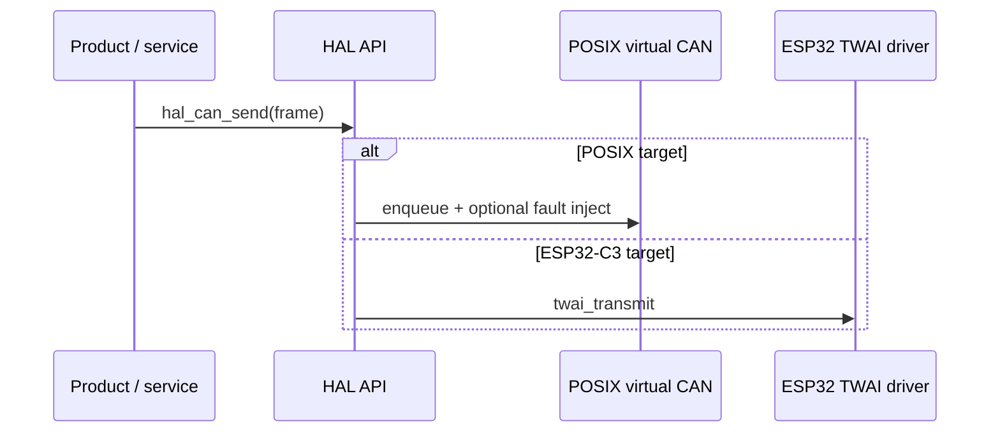

# Software architecture

## 1. Layering (mandatory)

```text
Application          products/  (and future apps/)
        ↓
Automotive services  diagnostics, health, fault, security, OTA, ECU models
        ↓
Protocol stack       CAN service, ISO-TP, UDS, OBD, CRC/checksum
        ↓
Middleware           message bus, logger, config, telemetry enqueue
        ↓
OS abstraction       os_thread, os_mutex, os_queue, os_timer, …   ← NEW
        ↓
HAL                  hal_can, hal_uart, hal_gpio, … 
        ↓
Driver               posix/  or  esp32/
        ↓
Hardware or virtual hardware
```

**The application must not include** `<pthread.h>`, FreeRTOS headers, or ESP-IDF headers.

| Layer | May include | Must not include |
|---|---|---|
| Application | services, protocols public API, middleware | OSAL internals, drivers, IDF, pthread |
| Services | protocols, middleware, common, OSAL **API** | drivers, IDF, pthread |
| Protocols | common, framework, HAL **types and HAL API** | IDF, product headers, pthread |
| Middleware | common, OSAL API, HAL API | UDS internals, product |
| OSAL POSIX | pthread, POSIX clocks | UDS, product, IDF |
| OSAL FreeRTOS | FreeRTOS, ESP-IDF OS bits | UDS, product |
| HAL API | common types only | pthread, IDF |
| Drivers POSIX | HAL API, sockets/files | UDS |
| Drivers ESP32 | HAL API, ESP-IDF | UDS, BLE application logic |

## 2. Languages

| Domain | Language | Why |
|---|---|---|
| Firmware / portable core | C11 | Predictable ABI, MISRA-inspired review, no exceptions on MCU |
| Virtual ECU, GUI bindings, host tools | C++ | RAII at the process edge, not on the CAN RX path |
| Cloud / dashboard (future) | Documented separately | Must not leak into `platform/` |

C++ in the core: interfaces and strong types are allowed in host-only tools. Firmware stays C. Smart pointers and STL containers are **POSIX-host tools only**, never on the frame path.

## 3. Existing core (keep and harden)

Already portable C (no IDF includes):

- `ae_status_t` module×reason errors  
- Ring buffer  
- CAN frame type (`ae_can_frame_t`)  
- CAN service, ISO-TP, UDS, DTC, fault manager, ECU models, OTA state machine  
- BLE characteristic IDs with host inject/notify shim  

Missing as software modules:

- OSAL  
- Integrity (CRC, alive counter, plausibility as a layer)  
- Health manager  
- Logger / config store / telemetry  
- PWM / timer / flash HAL as first-class contracts (partially folded into `hal_misc.h`)  
- Network HAL for MQTT  

## 4. Error and memory policy

- Public APIs return `ae_status_t` (`0` = success).
- No heap on CAN RX, ISO-TP, or UDS data paths.
- Static pools and ring buffers.
- Callers own objects they pass in; HAL does not retain caller buffers after return unless documented (ISR callback is copy-by-value of `ae_can_frame_t`).

## 5. Configuration

Compile-time product index (`AE_PRODUCT_INDEX`) selects one composition per binary on MCU.

Runtime config (later): schema-versioned blob in NVS (ESP32) or file (POSIX). Invalid schema → factory defaults.

Cloud credentials: environment or a gitignored file. Never commit broker passwords.

## 6. Simulation vs hardware from the application’s view



If the application can tell which backend is linked, the abstraction has leaked.

---

**Embedded AI Design Labs Pvt Ltd**  
Muhammad Samiullah  
CTO & Founder  
© 2026 Copyright. All rights reserved.
