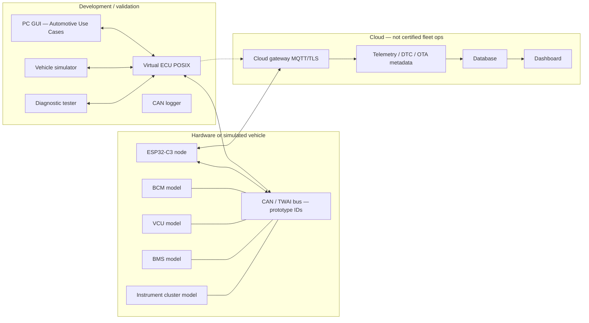
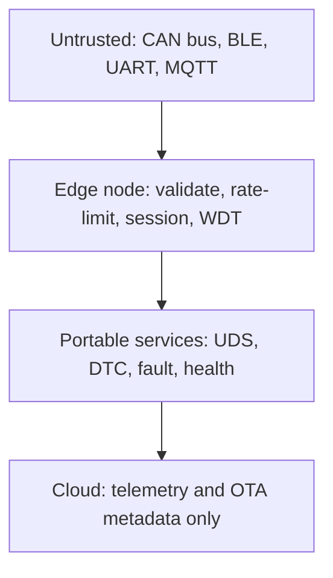

# System architecture

Nodes, networks, and responsibilities. Application code is portable; only OSAL, HAL, and drivers differ per target.

## 1. System context

| Node | Role | Runs on |
|---|---|---|
| Virtual ECU | Same services as firmware; in-memory or socket CAN | POSIX/Linux or Windows host |
| ESP32-C3 ECU | Real TWAI, UART, GPIO, BLE, NVS, WDT | ESP-IDF + FreeRTOS |
| Vehicle simulator | Physics and driver inputs → signals | POSIX app |
| CAN network | Frames with prototype IDs | Memory bus, socket, or transceiver |
| BLE device | Phone/PC GATT client (later) | Host shim today; NimBLE on C3 later |
| Cloud gateway | Device auth, telemetry ingest, commands | Separate process; credentials not in git |
| Cloud backend | Store health, DTC, OTA status | To be designed; SQLite local option for lab |
| Dashboard | Fleet/lab view | GUI today is local Virtual ECU only |

## 2. Product compositions (same core)

Products are compile-time selections, not forks:

1. Virtual ECU  
2. ESP32-C3 ECU  
3. BLE-CAN Gateway  
4. OBD-II Diagnostic Tool  
5. UDS Diagnostic Tester  
6. CAN Data Logger  
7. ECU Simulator  
8. ECU Test Box  
9. ECU Fault Injection Box  
10. ECU End-of-Line Tester  
11. EV Battery Diagnostic Gateway  
12. CAN Security Monitor  
13. HIL/RCP Interface  
14. Automotive Training Kit  
15. Cloud-connected Vehicle Gateway  

(Repository also lists TPMS gateway and config/calibration as P10–P12.)

## 3. Hardware assumptions (prototype)

- ESP32-C3: one TWAI (CAN 2.0) controller, BLE 5, no native dual-CAN.
- A second bus, if required, is an external controller behind the same `hal_can` contract.
- Default bitrate 500 kbit/s (configurable 125/250/500/1000).
- VIN DID `0xF190` prototype string: `AEGWC3PROTO00001`.

## 4. Trust and safety boundary

Do not treat MQTT or BLE as a safety channel. Safe state on the node is local: TX silent policy, default outputs, watchdog.

---

**Embedded AI Design Labs Pvt Ltd**  
Muhammad Samiullah  
CTO & Founder  
© 2026 Copyright. All rights reserved.
